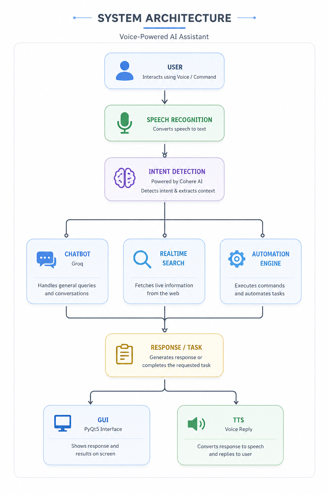
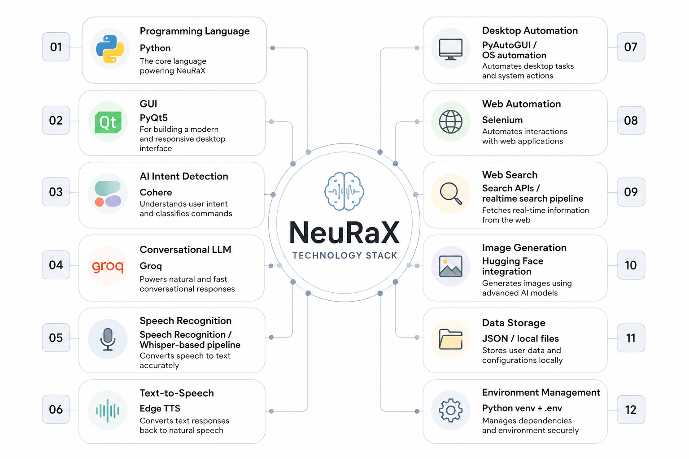

# 🧠 NeuRaX : Personal AI Desktop Assistant


A voice-powered AI desktop assistant that understands natural language, reasons over user requests, and performs real actions on the computer.

NeuRaX is a Python-based personal AI assistant designed to bridge the gap between conversational AI and real-world desktop automation.

Instead of only generating text responses, NeuRaX can understand spoken commands, classify user intent, interact with AI models, perform desktop actions, search for real-time information, open applications, execute multiple tasks, and respond through both a graphical interface and voice.


## What Makes this diffrent?
Most AI chatbots stop at:

User → Question → AI → Answer

NeuRaX extends this workflow:


## Features

### 🎙️ Natural Voice Interaction

- Speak naturally instead of typing commands.
- NeuRaX converts speech into text and processes it through its AI intent pipeline.

**Example:**

> "Open Chrome and search Google Careers."

NeuRaX can interpret the request and execute the corresponding actions.

---

### 🧠 AI-Powered Intent Detection

NeuRaX doesn't directly send every command to the same model.

A dedicated intent layer analyzes each request and categorizes it into different execution paths:

- `general`
- `realtime`
- `open`
- `close`
- `play`
- `system`
- `content`
- `google search`
- `youtube search`

This allows the system to distinguish between different types of requests:

- **General question:**  
  > "What is artificial intelligence?"

- **Application command:**  
  > "Open Chrome."

- **Search command:**  
  > "Search Google Careers."

---

### 🤖 Conversational AI

For general questions and conversations, NeuRaX uses an LLM-powered chatbot pipeline.

**Example:**

**User:**
> "What is machine learning?"

**NeuRaX:**
> Provides an AI-generated explanation.

The conversational layer is separated from the automation layer so that normal conversations don't unnecessarily trigger system actions.

---

### 🖥️ Desktop Automation

NeuRaX can interact with the user's desktop environment.

Current automation capabilities include:

- Opening applications
- Closing applications
- Opening Google Chrome
- Opening WhatsApp
- Searching Google
- Searching YouTube
- Playing requested content
- Executing system-level actions
- Running multiple detected actions from a single request

**Example:**

> "Open Chrome and search Google Careers."

NeuRaX can interpret this as multiple actions:

1. Open Chrome
2. Perform Google search

---

### 🔎 Real-Time Search

For queries requiring current information, NeuRaX can route the request through its real-time search pipeline instead of relying only on the LLM's static knowledge.

**Example:**

> "What is the latest information about AI?"

The system can route the query through its real-time search workflow before generating the final response.

---

### 🗣️ Text-to-Speech

NeuRaX doesn't only display responses. The generated response can also be converted back into speech.

```text
User Voice
    ↓
Speech → Text
    ↓
AI Processing
    ↓
Text Response
    ↓
Text → Speech
    ↓
🔊 NeuRaX speaks
```

## System Architecture

<p align="center">
  
</p>## Technology Stack

<p align="center">
  
</p>

## System Architecture

<p align="center">
  
</p>

## Future Vision

The long-term vision of NeuRaX is to evolve from a traditional voice assistant into a personal autonomous AI agent that can understand not only individual commands, but complete user goals.

NeuRaX aims to understand the user's intent, break complex goals into actionable steps, select and use the appropriate tools, interact with the operating system, maintain meaningful context, execute tasks, and verify the results before reporting back to the user.

The ultimate goal is to create an AI that doesn't simply tell the user what to do, but can intelligently plan, act, verify, and assist while keeping the user in control of important decisions and sensitive operations.

## Project Goal

NeuRaX is being developed with the vision of creating a reliable, extensible, and user-controlled AI agent for everyday computer interaction.

Future development will focus on:

🧠 Intelligent task planning
🔗 Multi-step workflow execution
💾 Persistent memory and contextual understanding
🛠️ Dynamic tool and plugin integration
💻 AI-powered developer assistance
🔐 Permission-based and secure automation
🛡️ Prompt-injection and unsafe-action protection
🔄 Self-verification and failure recovery
📊 Task execution monitoring and observability

From an AI that answers questions to an AI that understands goals, takes action, and gets things done.

